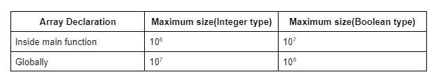
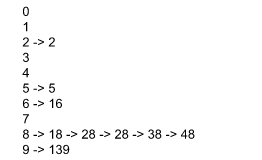
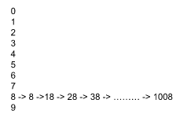

#### What is Hashing
it is nothing but the combination of the steps, pre-storing, and fetching.

#### Problems that are require hashing
- Number that are appears in array how many time ?
- Characters appears in string ?

#### Hashing 

We will assign the hashing array to number and increase it value if it appears again

**code**
```
import java.util.*;

class tUf {

    public static void main(String[] args) {
        Scanner sc = new Scanner(System.in);

        int n;
        n = sc.nextInt();
        int[] arr = new int[n];
        for (int i = 0; i < n; i++) {
            arr[i] = sc.nextInt();
        }

        //precompute:
        int[] hash = new int[13];
        for (int i = 0; i < n; i++) {
            hash[arr[i]] += 1;
        }

        int q;
        q = sc.nextInt();
        while (q-- != 0) {
            int number;
            number = sc.nextInt();
            // fetching:
            System.out.println(hash[number]);
        }
    }
}
```

##### Character Hashing 
We are using ASCII
ASCII is a 7-bit character set containing 128 characters.
It contains the numbers from 0-9, the upper and lower case English letters from A to Z, and some special characters.
The character sets used in modern computers, in HTML, and on the Internet, are all based on ASCII.

case 1: If string contains only lower case character
 corresponding value = given character - 'a'

For example, if the given character is ‘f’, we will get the value as (‘f’ - ‘a’) = (102-97) = 5.  Here, we can easily observe that the maximum value can be 25.

```
  // s is giver array
 char[] hash = new char[26];
        for (int i = 0; i < n; i++) {
            hash[s[i] - 'a'] += 1;
        }
```

case 2: Array contains only uppercase letters
we will make hash array of size 256

```
//precompute:
        int[] hash = new int[256];
        for (int i = 0; i < s.length(); i++) {
            hash[s.charAt(i)]++;
        }
```

#### How to use HashMap to solve the problems

We may encounter a problem where the maximum array element may be very large like 109. In that case, theoretically, we should declare an array of size 109+1. But we cannot do so we are using HashMaps Collections in java. The maximum size of an array can be the following:



Hashing is done using many methods some of them are
- Division Method
- Folding Method
- Mid-square Method

##### Division Method

This is division method. In order to solve this we will use the division method. We will simply consider the modulo 10 of each element of the array(element % 10) and we will hash(pre-store and fetch) the elements on the basis of the modulo value i.e. the remainder. The steps will look like the following:

`Pre storing: hash[arr[i]%10] += 1 and Fetching: hash[number%10]`

 For same numbers we are using linear chaining like linked list show in daigram.



Collision
Now, if we are applying linear chaining and division rule and we find that all elements of an array get stored in a single index, then we will call it a case of collision.

example



**Maximum time it will take will be O(n) and minimum time it will be O(1) for unordered hashmap**

**For Ordered HashMaps it will take logO(n)**

```
//precompute:
        HashMap<Integer, Integer> mp = new HashMap<>();
        for (int i = 0; i < n; i++) {
            int key = arr[i];
            int freq = 0;
            if (mp.containsKey(key)) freq = mp.get(key); // fetching from the map
            freq++;
            mp.put(key, freq); // inserting into the map
        }

        // Iterate over the map:
        /*
        for (Map.Entry<Integer, Integer> it : mp.entrySet()) {
            System.out.println(it.getKey() + "->" + it.getValue());
        }
        */

        int q;
        q = sc.nextInt();
        while (q-- > 0) {
            int number;
            number = sc.nextInt();
            // fetch:
            if (mp.containsKey(number)) System.out.println(mp.get(number));
            else System.out.println(0);
        }
```


