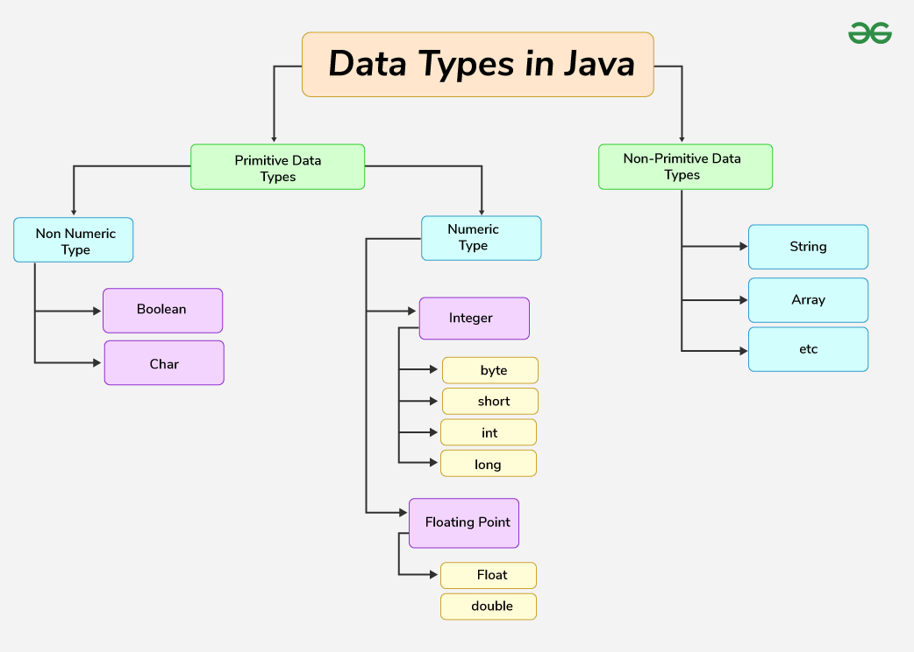
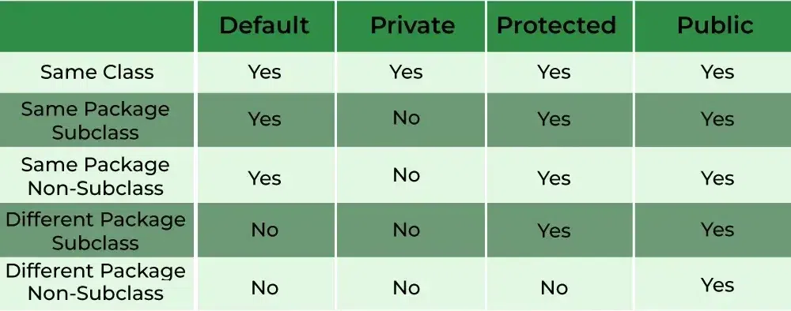

https://www.geeksforgeeks.org/java/ - links
- developed by james gosling

What is Java
- object-oriented programming language
- Write once and run anywhere
- source code -> compiler -> byte code

Features of java
- Platform Independence
- Object orianted
- Secure
- Multi-threading (****concurrent execution**** of multiple parts of a program)
- High Performance due to JIT

![[gfg-java-code-execution.jpg]]

### Java Hello world [Code](HelloWorld.java)

- public: So that JVM can execute the method from anywhere.
- static: The main method is to be called without an object. The modifiers are public and static can be written  in        either order.
- void: The main method doesn’t return anything.
- main(): Name configured in the JVM. The main method must be inside the class definition. The compiler executes the codes starting always from the main function.
- String[]: The main method accepts a single argument, i.e., an array of elements of type String.

    **Explanation for print statement**
   
   `System.out.println("Hello World");`

- System: It is the predefined class which is present in the java.lang package which provides the system resources for input and output.
- out: It is a static field of type PrintStream in the System class used to represent the standard output stream on the console.
- . (dot): It is the member access operator also known as link operator used to access the members of class or objects i.e fields and methods.
- println(): It is the method of PrintStream class which is used to print the message on the new line written inside as string”” (enclosed with double quotes).

### Java Identifiers
**An identifier in Java is the name given to Variables, Classes, Methods, Packages, Interfaces, etc. These are the unique names and every Java Variables must be identified with unique names.**
- Alphanumeric names given to identifiers
- should not start with number
- should not have specail characters (Only _ and $ is allowed)
- should not be reversed word there are 53 reversed words

There are 67 Keywords in Java.

### Java Datatypes [code](DataTypes.java)


- What are datatypes ?
    Data types are of different sizes and values that can be stored in the variable

- Which is primitive data types
    Primitive data types are the types in java that can store a single value and do not provide any special capability. 

### Java Flow Control [Code](FlowControl.java)

### Java Methods [code](Methods.java)
  **What is functions: Block of code that perform specific task**\
  **All methods in Java must belong to a class. Methods are similar to functions and expose the behavior of objects.**
  
  Syntax of Method
  ```
      <access_modifier> <return_type> <method_name>( list_of_parameters)
    {
        //body
    }
  ```

 - Static variables/methods can be accessed without an object (they belong to the class).
 -  Non-static variables/methods require an object to access them (they belong to an instance of the class).
 - You can mix static and non-static members, but you need to understand that static members are accessible without objects, 
and non-static members are accessible only through an object.

### Java Access Modifiers
