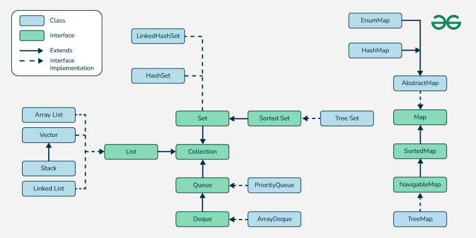

# Java Collections

**Knowledge required before learning java collection**
- [ ] Java classes
- [ ] Java interfaces

### Introduction of Java Collections
  - Any group of individual objects that are represented as a single unit
  - Two main “root” interfaces of Java collection classes.
    1) `java.util.Collection`
    2) `java.util.Map`

