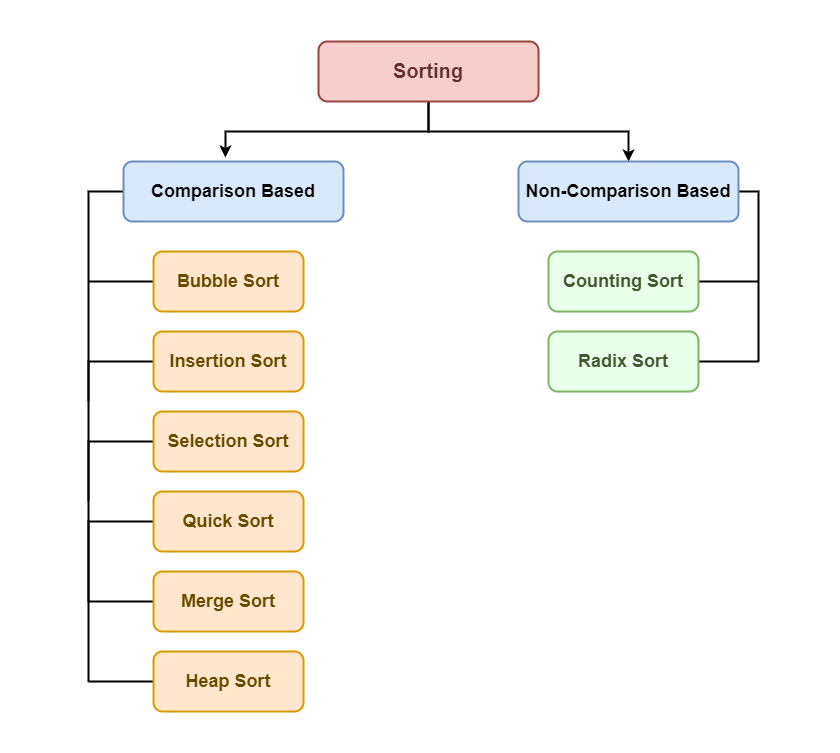

# Sorting

**Sorting reffer to rearrangement of array to make in order. Like ascending order or decending order**

#### Why we use Sorting
- when we have large data you want to arrange it in particular pattern
- When we sort data we can get largest or smallest number easily also we can search the data easily


#### Sorting Basics [Link for article](https://www.geeksforgeeks.org/introduction-to-sorting-algorithm/?ref=lbp)
- In-Space sorting: An in-place sorting algorithm uses constant space for producing the output (modifies the given array only. Examples: Selection Sort, Bubble Sort, Insertion Sort and Heap Sort.
- Iternal Sorting: when all the data is placed in the main memory or internal memory. In internal sorting, the problem cannot take input beyond allocated memory size.
- External Sorting: External Sorting is when all the data that needs to be sorted need not to be placed in memory at a time, the sorting is called external sorting. External Sorting is used for the massive amount of data. For example Merge sort can be used in external sorting as the whole array does not have to be present all the time in memory,
- Stable Sort: When two same items appear in the same order in sorted data as in the original array called stable sort. Examples: Merge Sort, Insertion Sort, Bubble Sort.
Multiple Sort: A sorting algorithm is called Hybrid if it uses more than one standard sorting algorithms to sort the array. The idea is to take advantages of multiple sorting algorithms. For example IntroSort uses Insertions sort and Quick Sort.

### Types of Sorting



----
### Selection Sort
**select min and swap**

sudo code

```java
int len = arr.length;
        for (int i = 0; i < len - 1; i++) {
            int min = i; // find the minimum index
            for(int j = i + 1; j < len; j++ ){ // increase index by i + 1;
               if(arr[j] < arr[min]){ // check if current index value is minium than minum index
                  min = j; // assign minium index
               }
            }
            // Assign the value
                int temp = arr[i];
                arr[i] = arr[min];
                arr[min] = temp;    
        }
```

for recursion method
fristFunction -> That will work as frist loop (it is recursive function)
secondFunction -> That will work as second loop (it it recursive fucntion)

**Time Complexity**\
Best      O(n^2)\
Average   O(n^2)\
Worst     O(n^2)

-----

### Bubble Sort

**Pushes max number to last by adjacent swapping**

sudo code

```java
   // if we get already sorted array which is best case 
    int len = arr.length;
        for (int i = len - 1; i >= 0; i--) { // run from n-1 every time
            for (int j = 0; j <= i - 1; j++) {
                if(arr[j] > arr[j+1]){ //check the maximum
                    int temp = arr[j + 1]; //adjusent swap
                    arr[j+1] = arr[j];
                    arr[j] = temp;
                }
            }
        }
    }
```

**Time Complexity**/
Best      O(n)\
Average   O(n^2)\
Worst     O(n^2)

How Best Time Complexity is **O(n)** ?

We will check in the first iteration if any swap is taking place. If the array is already sorted no swap will occur and we will break out from the loops. 
Thus the iteration of the outer loop will be just 1. And our overall time complexity will be O(N).

```java
for (int i = len - 1; i >= 0; i--) {
            int didSwap = 0;
            for (int j = 0; j <= i - 1; j++) {
                if(arr[j] > arr[j+1]){
                    int temp = arr[j + 1];
                    arr[j+1] = arr[j];
                    arr[j] = temp;
                    didSwap = 1;
                }
            }
            if(didSwap == 0){
                break; // we will break out if any swap is not happen
            }
            System.out.println("print");
        }
```

-----

### Insertion Sort
**Always take element and swap it unit it is in right position**

sudo code

```java
int n = arr.length;
        for (int i = 0; i <= n-1; i++) {
            int j = i;
            while(j>0 && arr[j - 1]>arr[j]){
                int temp = arr[j - 1];
                arr[j-1] = arr[j];
                arr[j] = temp;

                j--;
            }
        }
```

**Time Complexity**/
Best      O(n)\
Average   O(n^2)\
Worst     O(n^2)

If it get the sorted array which is best case then it will run only time no inner while loop will be run

-----
### Merge Sort
**Divide and Merge**

sudo code

```java
 public static void mSort(int[] arr, int low, int high){//Dvivide the array using recurssion until it come to single digit
        if(low == high) return;
        int mid = (low + high) / 2;
        mSort(arr, low, mid);
        mSort(arr, mid + 1, high);
        merg(arr, low, mid, high);
    }

    public static void merg(int[] arr, int low, int mid, int high){
        ArrayList<Integer> temp = new ArrayList<Integer>();//temp array to merge the two sorted array
        int left = low;
        int right = mid + 1;
        while(left<=mid && right<=high){  
            if(arr[left]<=arr[right]){
                temp.add(arr[left]);
                left++;
            }else{
                temp.add(arr[right]);
                right++;
            }
        }

        while(left<=mid){
            temp.add(arr[left]);
            left++;
        }

        while (right<=high) {
            temp.add(arr[right]);
            right++;
        }

        for (int index = low; index <= high ; index++) { // assiging temp array to original array in order
            arr[index] = temp.get(index - low);
        }
    }
```

**Time Complexity**/
Best      O(nlogn)\
Average   O(nlogn)\
Worst     O(nlogn)

**Space Complexity**\
O(n)

-----

